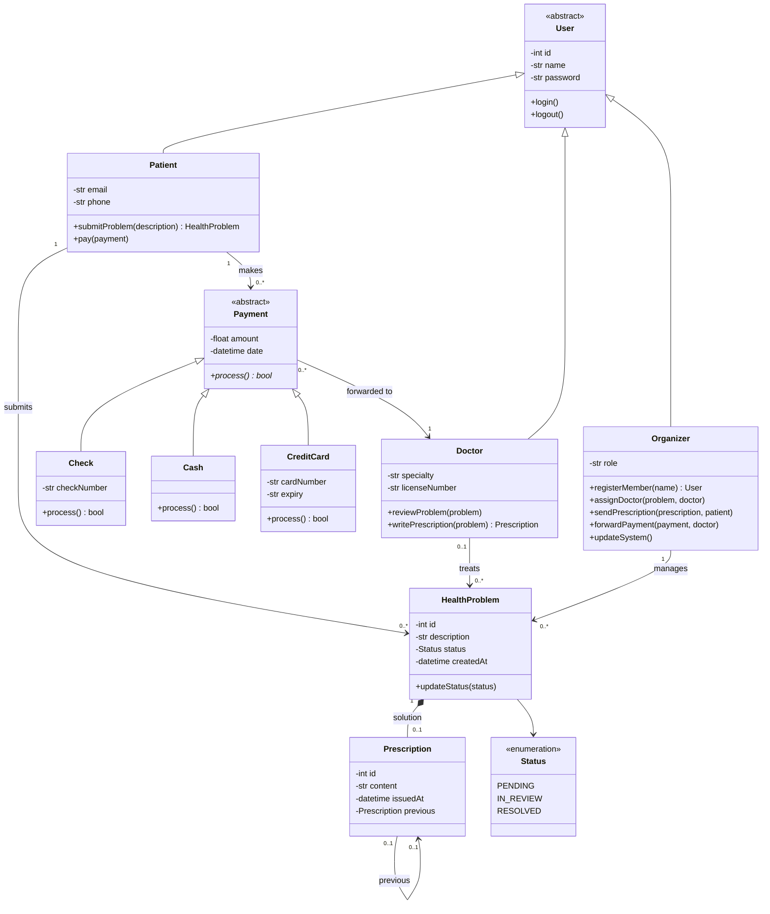
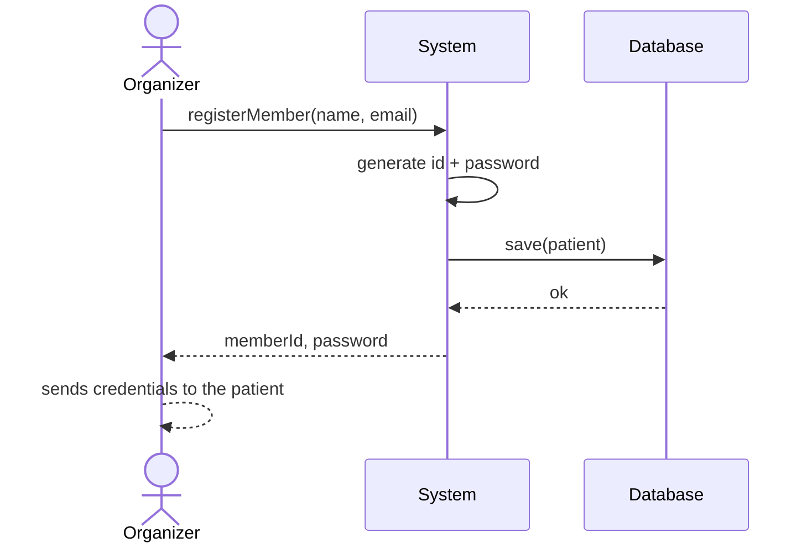
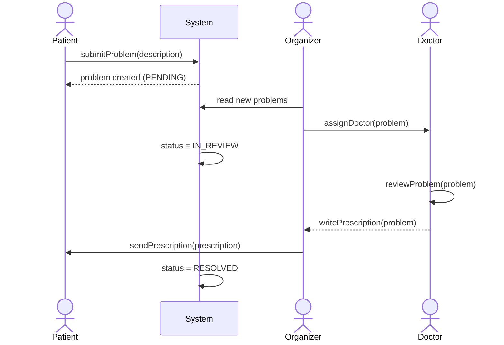
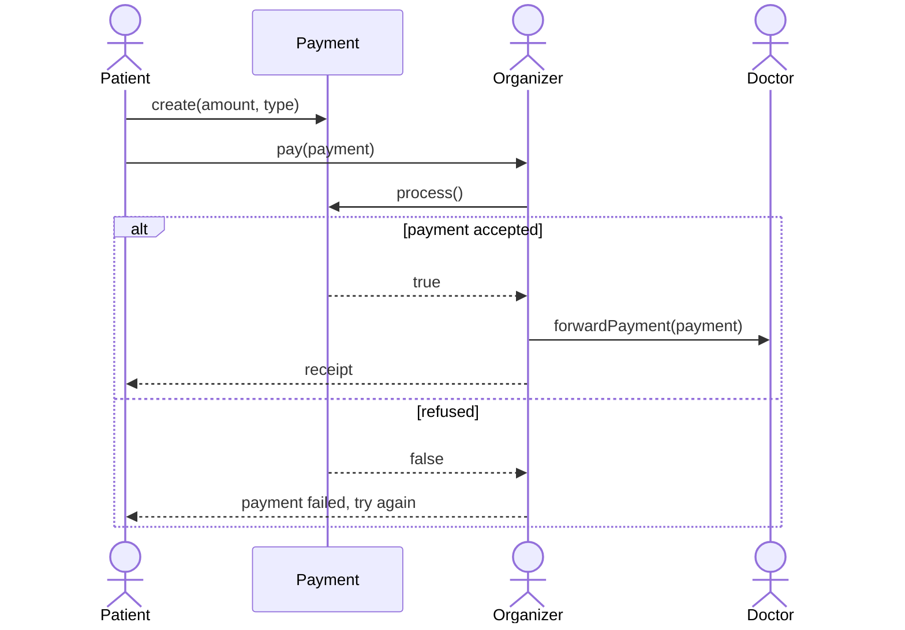

# Exo 1 - Hospital Management System

## Class diagram

```mermaid
classDiagram
    class User {
        <<abstract>>
        -int id
        -str name
        -str password
        +login()
        +logout()
    }
    class Patient {
        -str email
        -str phone
        +submitProblem(description) HealthProblem
        +pay(payment)
    }
    class Doctor {
        -str specialty
        -str licenseNumber
        +reviewProblem(problem)
        +writePrescription(problem) Prescription
    }
    class Organizer {
        -str role
        +registerMember(name) User
        +assignDoctor(problem, doctor)
        +sendPrescription(prescription, patient)
        +forwardPayment(payment, doctor)
        +updateSystem()
    }
    class HealthProblem {
        -int id
        -str description
        -Status status
        -datetime createdAt
        +updateStatus(status)
    }
    class Status {
        <<enumeration>>
        PENDING
        IN_REVIEW
        RESOLVED
    }
    class Prescription {
        -int id
        -str content
        -datetime issuedAt
        -Prescription previous
    }
    class Payment {
        <<abstract>>
        -float amount
        -datetime date
        +process()* bool
    }
    class Check {
        -str checkNumber
        +process() bool
    }
    class Cash {
        +process() bool
    }
    class CreditCard {
        -str cardNumber
        -str expiry
        +process() bool
    }

    User <|-- Patient
    User <|-- Doctor
    User <|-- Organizer
    Payment <|-- Check
    Payment <|-- Cash
    Payment <|-- CreditCard

    Patient "1" --> "0..*" HealthProblem : submits
    Organizer "1" --> "0..*" HealthProblem : manages
    Doctor "0..1" --> "0..*" HealthProblem : treats
    HealthProblem "1" *-- "0..1" Prescription : solution
    HealthProblem --> Status
    Prescription "0..1" --> "0..1" Prescription : previous
    Patient "1" --> "0..*" Payment : makes
    Payment "0..*" --> "1" Doctor : forwarded to
```

## Sequence diagrams

### Patient registration

```mermaid
sequenceDiagram
    actor O as Organizer
    participant S as System
    participant DB as Database
    O->>S: registerMember(name, email)
    S->>S: generate id + password
    S->>DB: save(patient)
    DB-->>S: ok
    S-->>O: memberId, password
    O-->>O: sends credentials to the patient
```

### Consultation flow

```mermaid
sequenceDiagram
    actor P as Patient
    participant S as System
    actor O as Organizer
    actor D as Doctor
    P->>S: submitProblem(description)
    S-->>P: problem created (PENDING)
    O->>S: read new problems
    O->>D: assignDoctor(problem)
    S->>S: status = IN_REVIEW
    D->>D: reviewProblem(problem)
    D-->>O: writePrescription(problem)
    O->>P: sendPrescription(prescription)
    S->>S: status = RESOLVED
```

### Payment processing

```mermaid
sequenceDiagram
    actor P as Patient
    participant Pay as Payment
    actor O as Organizer
    actor D as Doctor
    P->>Pay: create(amount, type)
    P->>O: pay(payment)
    O->>Pay: process()
    alt payment accepted
        Pay-->>O: true
        O->>D: forwardPayment(payment)
        O-->>P: receipt
    else refused
        Pay-->>O: false
        O-->>P: payment failed, try again
    end
```
